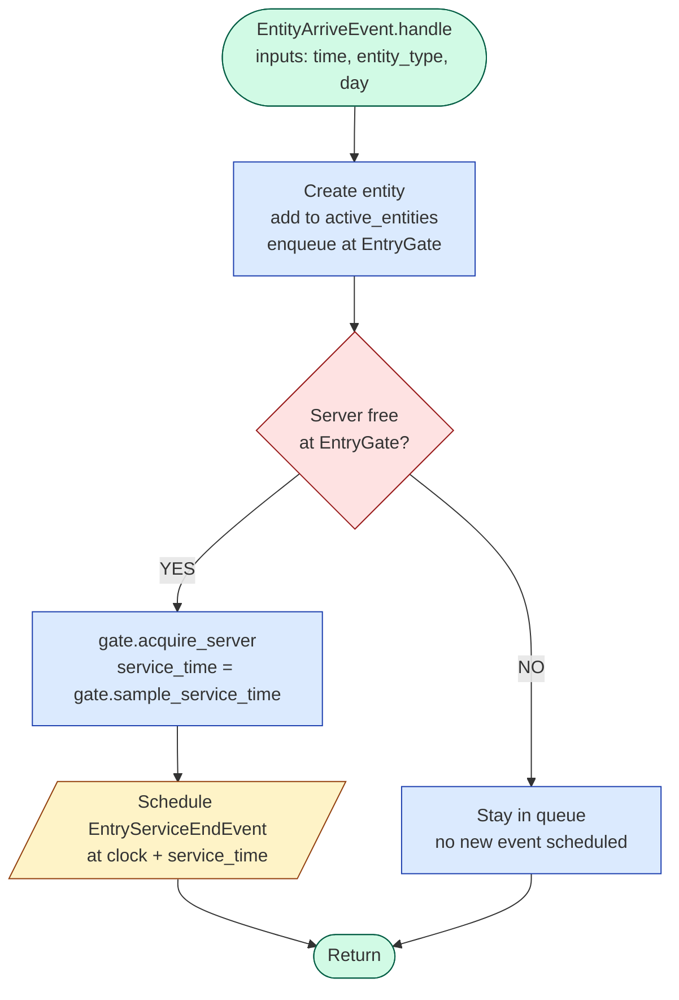
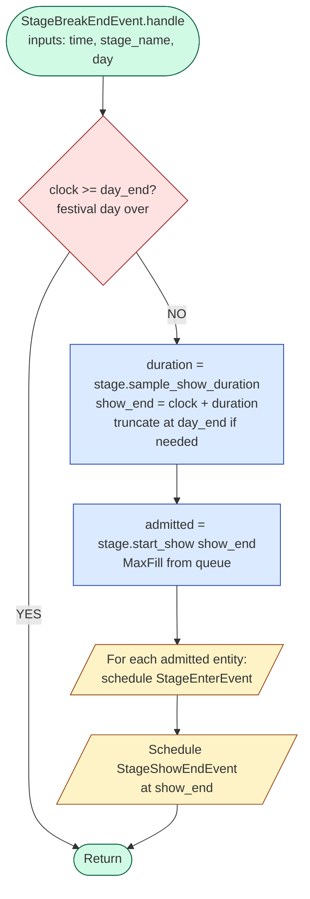
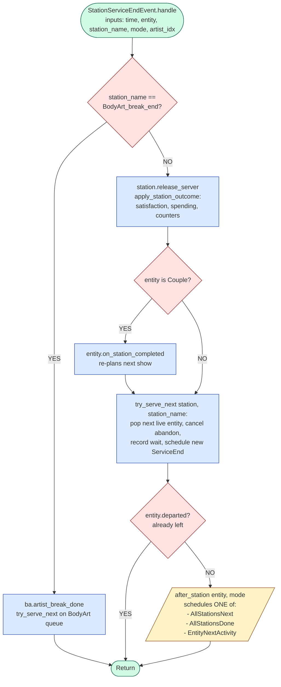

# Event-Handling Diagrams (Mermaid format)

These are the same three flowcharts as `event_handling_diagrams.md`, but
written in **Mermaid** syntax so they can be imported into draw.io
(or rendered automatically by GitHub / VS Code / Colab Markdown).

## How to import into draw.io

1. Open [app.diagrams.net](https://app.diagrams.net)
2. `Arrange` (top toolbar) → `Insert` → `Advanced` → `Mermaid...`
3. Paste the Mermaid block (everything between the ` ```mermaid ` fences)
4. Click `Insert` — the diagram appears on the canvas, fully editable

Once inserted you can:
- Drag/resize boxes
- Change colors and fonts
- Export as PNG / SVG / PDF
- Save as `.drawio` for later editing

---

## 1. `EntityArriveEvent`

A new entity arrives at the festival entry gate.



---

## 2. `StageBreakEndEvent`

A stage's inter-show break has ended; the next performance can begin.
**Key pattern:** one event spawns N+1 follow-up events.



---

## 3. `StationServiceEndEvent`

Service at a station completes for the served entity.
**Key pattern:** most-branching handler in the model.



---

## Colour legend

The `classDef` styles produce a colour-coded diagram in draw.io:

| Colour | Meaning |
|---|---|
| 🟢 Green | Start / End (entry & exit of the handler) |
| 🔵 Blue | State change / function call |
| 🟡 Yellow | Event scheduled onto the heap |
| 🔴 Red | Decision (if/else) |

After import you can tweak the colours via the Format panel on the right.

---

## Tip for the Colab report

If you want the diagrams to render automatically in the Colab notebook,
just paste the ```` ```mermaid ```` block into a Markdown cell.
Modern Colab supports Mermaid in Markdown cells natively, so they will
render as proper flowcharts without needing image files at all.
